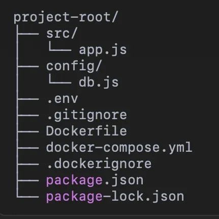
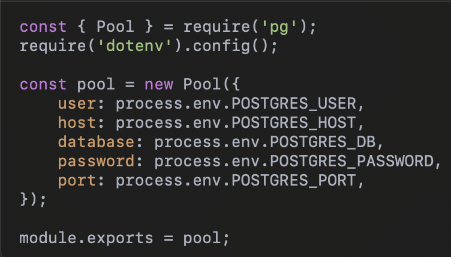
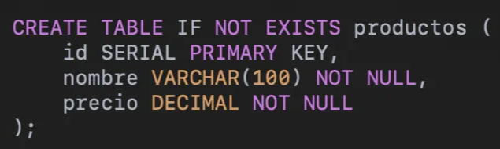

# Implementación de un Microservicio de Productos con PostgreSQL y Docker

<aside>
📖 Universidad de las Fuerzas Armadas - ESPE
Realizado por:
✅ Cristian Tello
✅ Karol Macas
✅ Mateo Barriga
10 de noviembre de 2024 
🖥️ Aplicaciones Distribuidas - NRC: 2546
🖥️ Proyecto: [https://github.com/M4t3B4rriga/microservicio_distribuidas/tree/main](https://github.com/M4t3B4rriga/microservicio_distribuidas/tree/main)

</aside>

Este proyecto consiste en la creación de un microservicio para la gestión de productos utilizando Node.js, PostgreSQL y Docker. El microservicio permite realizar operaciones CRUD (Crear, Leer, Actualizar y Eliminar) sobre productos, almacenando los datos en una base de datos PostgreSQL. El uso de Docker permite encapsular tanto el microservicio como la base de datos en contenedores, facilitando la portabilidad y el despliegue en diferentes entornos sin preocuparse por problemas de configuración.

**Estructura del Proyecto**

La estructura del proyecto está organizada de la siguiente manera:

• **src/app.js**: Contiene el código principal del microservicio, incluyendo las rutas CRUD para la gestión de productos.

• **config/db.js**: Configura la conexión a PostgreSQL usando variables de entorno.

• **.env**: Almacena las variables de entorno para la conexión entre Node.js y PostgreSQL.

• **Dockerfile**: Define las instrucciones para construir el contenedor Docker del microservicio Node.js.

• **docker-compose.yml**: Orquesta los contenedores de PostgreSQL y el microservicio, estableciendo su conexión.

• **.dockerignore y .gitignore**: Excluyen archivos innecesarios del contenedor Docker y del repositorio Git, respectivamente.

**Funcionamiento de la Base de Datos en PostgreSQL**

La base de datos en PostgreSQL es fundamental para este proyecto, ya que almacena toda la información sobre los productos. Aquí se detalla cómo se configura y funciona dentro de este sistema.

En este proyecto, PostgreSQL se ejecuta como un servicio dentro de un contenedor Docker, definido en el archivo docker-compose.yml. Las configuraciones principales para el contenedor de PostgreSQL incluyen:

**Imagen de PostgreSQL**: Se usa la imagen oficial de PostgreSQL (postgres:13), que incluye todas las herramientas necesarias para ejecutar la base de datos.

- **Variables de Entorno**: Se definen variables como POSTGRES_USER, POSTGRES_PASSWORD y POSTGRES_DB para configurar el usuario de la base de datos, la contraseña y el nombre de la base de datos al momento de iniciar el contenedor.
- **Persistencia de Datos**: Se usa un volumen (pgdata) para que los datos en PostgreSQL sean persistentes, lo que significa que los datos se conservarán aunque el contenedor sea eliminado o reiniciado.

**Conexión a la Base de Datos desde Node.js**

La conexión a PostgreSQL se configura en el archivo config/db.js utilizando el módulo pg de Node.js. Este archivo toma las variables de entorno definidas en .env y crea una instancia de Pool para gestionar las conexiones a la base de datos.

Esta instancia de Pool se reutiliza en todas las operaciones de la API, permitiendo una interacción eficiente con la base de datos.

**Creación y Estructura de la Tabla de Productos**

Al iniciar la aplicación, se crea la tabla "productos" (si no existe) utilizando el siguiente script SQL:

**Operaciones CRUD en PostgreSQL**

1. **Crear Producto**: Al recibir una solicitud POST en /productos, la API ejecuta una consulta SQL INSERT INTO para agregar un nuevo producto a la tabla. La consulta incluye RETURNING \* para devolver los datos del producto recién creado.
2. **Leer Productos**: Para listar los productos, se emplea una consulta SELECT \* FROM productos, que recupera todos los registros de la tabla.
3. **Actualizar Producto**: Ante una solicitud PUT en /productos/:id, se ejecuta una consulta UPDATE que modifica el nombre y el precio del producto con el ID especificado.
4. **Eliminar Producto**: Para eliminar un producto, se utiliza una consulta DELETE FROM productos WHERE id = $1, que remueve el producto cuyo ID se proporciona en la solicitud.
