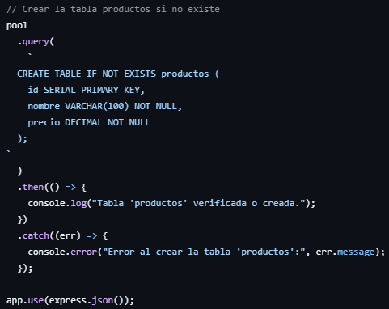
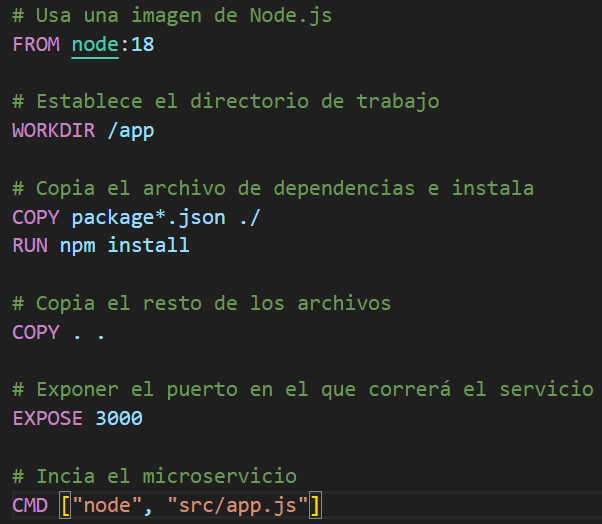

# Implementación de un Microservicio de Productos con PostgreSQL y Docker

<aside>
📖 Universidad de las Fuerzas Armadas - ESPE
Realizado por:
✅ Cristian Tello
✅ Karol Macas
✅ Mateo Barriga
10 de noviembre de 2024 
🖥️ Aplicaciones Distribuidas - NRC: 2546
🖥️ Proyecto: [https://github.com/M4t3B4rriga/microservicio_distribuidas/tree/main](https://github.com/M4t3B4rriga/microservicio_distribuidas/tree/main)

</aside>

Este proyecto consiste en la creación de un microservicio para la gestión de productos utilizando Node.js, PostgreSQL y Docker. El microservicio permite realizar operaciones CRUD (Crear, Leer, Actualizar y Eliminar) sobre productos, almacenando los datos en una base de datos PostgreSQL. El uso de Docker permite encapsular tanto el microservicio como la base de datos en contenedores, facilitando la portabilidad y el despliegue en diferentes entornos sin preocuparse por problemas de configuración.

**Estructura del Proyecto**

La estructura del proyecto está organizada de la siguiente manera:


• **src/app.js**: Contiene el código principal del microservicio, incluyendo las rutas CRUD para la gestión de productos.

• **config/db.js**: Configura la conexión a PostgreSQL usando variables de entorno.

• **.env**: Almacena las variables de entorno para la conexión entre Node.js y PostgreSQL.

• **Dockerfile**: Define las instrucciones para construir el contenedor Docker del microservicio Node.js.

• **docker-compose.yml**: Orquesta los contenedores de PostgreSQL y el microservicio, estableciendo su conexión.

• **.dockerignore y .gitignore**: Excluyen archivos innecesarios del contenedor Docker y del repositorio Git, respectivamente.

Funcionamiento de microservicio. 

El funcionamiento del microservicio esat dividido en un CRUD en donde por medio de nuestra base de datos podremos realizar la pruebas correspondientes de cada una de nuestras funciones. 

- Función en caso de o tener una tabla de productos creada:  por medio esta función se creara una tabla dentro de la base de datos para poder ir agregando.



- Función para visualizar: Para poder ver los productos que tenemos dentro de nuestra tabla usaremos la siguiente función.


- Función para agregar: Para agregar a nuestra lista usamos a donde queremos mandar por medio de un SELECT*FROM y el nombre de nuestra tabla.


- Función para editar: Se especifica el nombre y el precio que se quiere cambiar y en donde se quiere cambiar que en este caso se buscara por medio del ID.


- Función eliminar producto: Para poder eliminar un producto se lo busca por medio del ID para poder borrar todo lo que contenga relacionado con el ID.


**Funcionamiento de la Base de Datos en PostgreSQL**

La base de datos en PostgreSQL es fundamental para este proyecto, ya que almacena toda la información sobre los productos. Aquí se detalla cómo se configura y funciona dentro de este sistema.

En este proyecto, PostgreSQL se ejecuta como un servicio dentro de un contenedor Docker, definido en el archivo docker-compose.yml. Las configuraciones principales para el contenedor de PostgreSQL incluyen:

**Imagen de PostgreSQL**: Se usa la imagen oficial de PostgreSQL (postgres:13), que incluye todas las herramientas necesarias para ejecutar la base de datos.

- **Variables de Entorno**: Se definen variables como POSTGRES_USER, POSTGRES_PASSWORD y POSTGRES_DB para configurar el usuario de la base de datos, la contraseña y el nombre de la base de datos al momento de iniciar el contenedor.
- **Persistencia de Datos**: Se usa un volumen (pgdata) para que los datos en PostgreSQL sean persistentes, lo que significa que los datos se conservarán aunque el contenedor sea eliminado o reiniciado.

**Conexión a la Base de Datos desde Node.js**

La conexión a PostgreSQL se configura en el archivo config/db.js utilizando el módulo pg de Node.js. Este archivo toma las variables de entorno definidas en .env y crea una instancia de Pool para gestionar las conexiones a la base de datos.


Esta instancia de Pool se reutiliza en todas las operaciones de la API, permitiendo una interacción eficiente con la base de datos.

**Creación y Estructura de la Tabla de Productos**

Al iniciar la aplicación, se crea la tabla "productos" (si no existe) utilizando el siguiente script SQL:


**Operaciones CRUD en PostgreSQL**

1. **Crear Producto**: Al recibir una solicitud POST en /productos, la API ejecuta una consulta SQL INSERT INTO para agregar un nuevo producto a la tabla. La consulta incluye RETURNING * para devolver los datos del producto recién creado.
2. **Leer Productos**: Para listar los productos, se emplea una consulta SELECT * FROM productos, que recupera todos los registros de la tabla.
3. **Actualizar Producto**: Ante una solicitud PUT en /productos/:id, se ejecuta una consulta UPDATE que modifica el nombre y el precio del producto con el ID especificado.
4. **Eliminar Producto**: Para eliminar un producto, se utiliza una consulta DELETE FROM productos WHERE id = $1, que remueve el producto cuyo ID se proporciona en la solicitud.

### Dockerizar el Proyecto de Microservicio

La dockerización permite encapsular la aplicación y la base de datos en contenedores, lo que asegura un entorno consistente y fácil de replicar.

Pasos para Dockerizar el Proyecto

1. Dockerfile: Este archivo contiene las instrucciones para construir la imagen en Docker del microservicio . Este archivo especifica como debe instalarse el entorno necesario apara ejecutar la aplicación, incluyendo dependencias como Node.js, configuraciones del sistema, etc.



1. docker-compose.yml: Este archivo orquesta la creación de los contenedores para el microservicio y la base de datos PostgreSQL. Define como se deben configurar los contenedores y las variables de entorno necesarias para la creación entre ellos.


1. .env: Contiene las variables de entorno necesarias para que la aplicación y el contenedor de PostgreSQL puedan comunicarse correctamente.

### Como Ejecutar el Proyecto en Docker

1. Asegurar de tener Docker y Docker Compose instalados.
2. Ejecutar el siguiente comando en la raíz del proyecto para construir las imágenes y levantar los contenedores definidor en el archivo docker-compose.yml

```bash
docker-compose up --build
```

1. Una vez que los contenedores estén en funcionamiento, el microservicio estará disponible en `http://localhost:3000` y la base de datos PostgreSQL en el puerto `5432`.
2.  Para verificar la ejecución de los contenedores usamos el siguiente comando para ver los contenedores en ejecución: 

```bash
docker ps
```

Nos debería mostrarnos los contenedores del microservicio y de PostgreSQL.


### Acceder al contenedor  PostgreSQL con psql

1. Para acceder al contenedor de PostgreSQL directamente con el siguiente comando.

```bash
docker exec -it microservicio_distribuidas-db-1 bash
```

1. Acceder a la terminal de PostgreSQL dentro del contenedor con el siguiente comando.

```sql
psql -U nombre_usuario
```

Nos permitirá ingresar a la línea de comandos de PostgreSQL con el usuario.


Verificamos con el siguiente comando los usuarios dentro de PostgreSQL.

```sql
\du
```


Verificamos con el siguiente comando la base de datos que existen dentro de PostgreSQL.

```sql
\l
```


Con el siguiente linea de comando de psql nos conectamos a la base de datos. (products_db).

```sql
\c productos_db
```


Verificamos con el siguiente comando las tablas que existen en la base de datos dentro de PostgreSQL.

```sql
\dt
```


Insertamos datos en la Tabla productos

```sql
INSERT INTO productos (nombre, precio) VALUES ('Producto 1', 100.00);
INSERT INTO productos (nombre, precio) VALUES ('Producto 2', 150.50);
INSERT INTO productos (nombre, precio) VALUES ('Producto 3', 200.75);
```

Verificamos los datos insertados con esta linea de comando:

```sql
SELECT * FROM productos;
```


Para salir de la consola de PostgreSQL es con la siguiente linea de comando.

```sql
\q
```

### Para verificar los endpoints CRUD del microservicio utilizaremos Thunder Client (una extensión de VS Code)

1. Verificar GET(Listar productos)
    - Seleccionamos el método GET en Thunder CLient
    - Ingresamos la URL `http://localhost:3000/productos`
    - Hacemos clic en Send
    
    
    
2. Verificar POST (Crear un Producto)
    - Ingresamos la URL `http://localhost:3000/productos`
    - Selecciona la pestaña **Body** en Thunder Client.
    - Elige la opción **JSON**.
    - Ingresamos los datos para crear un nuevo producto.
    - Hacemos clic en Send
    
    
    
3. Verificar PUT (Actualizar un producto)
    - Seleccionamos el método PUT en Thunder CLient
    - Ingresamos la URL `http://localhost:3000/productos/1`
    - Selecciona la pestaña **Body** en Thunder Client.
    - Elige la opción **JSON**.
    - Ingresamos los datos actualizados.
    - Hacemos clic en Send
    
    
    
4. Verificar DELETE (eliminar un producto)
    - Seleccionamos el método DELETE en Thunder CLient
    - Ingresamos la URL `http://localhost:3000/productos/4`
    - Hacemos clic en Send


### Persistencia de Datos en el Contenedor de PostgreSQL

Para asegurarnos que los datos se mantengan cuando se reinicie los contenedores, verificamos que tenemos un volumen persistente configurado para PostgreSQL. 
El volumen en el archivo `docker-compose.yml` debe estar configurado para que los datos no se pierdan al reiniciar el contenedor.


Esto garantiza que los datos de PostgreSQL se guardan fuera del contenedor y persisten incluso después de reiniciar los contenedores.

Verificamos:

- Reiniciamos el contenedor de PostgreSQL con:

```sql
docker restart microservicio_distribuidas-db-1
```


- Luego, verificamos si los datos en la base de datos siguen presentes:

```sql
docker exec -it microservicio_distribuidas-db-1 psql -U postgres -d products_db
SELECT * FROM productos;
```


Si los datos permanecen después de reiniciar, la persistencia está configurada correctamente.